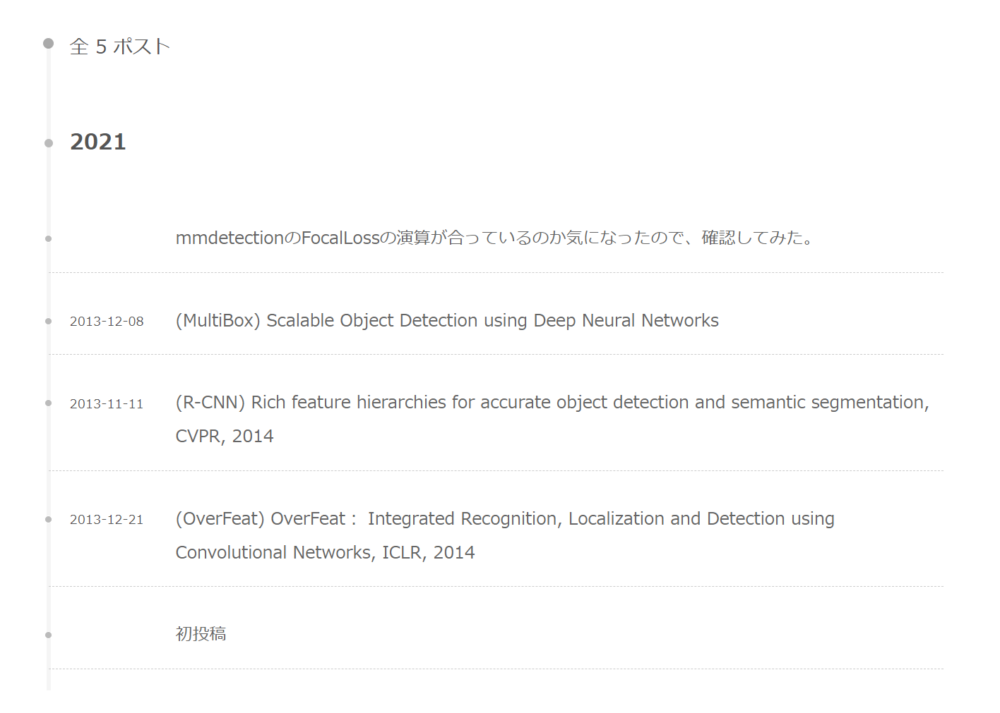

+++
title = '移行しました'
date = 2023-09-18T18:04:19+09:00
math = true
tags = ["General", ]
draft = false
+++

## 動機とか

以前はJekyllを使って自前サイトを作っていたのですが、なんか微妙に感じていました。<br>
Hugoもちょっと触ってみたいと思ったので、触ってみたら結構簡単でかつ好みのテーマがあったので、乗り換えてみようかなと感じました。

もう見なくなるサイトなので、写真だけ貼って供養します。<br>
論文を時系列に並べて関係性を広い意味で整理しようと `Archive` を投稿順に並べるところに当時はこだわりましたが、あんまり使わなかったですね。
あと、あんまり長い記事は書かなかったので、記事のスクロールに合わせて「アウトライン」のハイライトが遷移する機能も必要なかったですね...。

## 旧ページのギャラリー

トップページ


---
記事ページ


---

アーカイブページ<br>
わりかし苦労したやつ。レイアウトにこだわった。改善余地はあるが、当時の自分としては満足した。



---

## 移行に当たってのメモ

### 環境

- [Git](https://git-scm.com/download/linux)
- [Go](https://go.dev/doc/install)
- [Hugo-extended](https://gohugo.io/installation/linux/)<br>
    バイナリファイルを[ダウンロード](https://github.com/gohugoio/hugo/releases)
- [PaperMod](https://adityatelange.github.io/hugo-PaperMod/)
- [hugo-embed-pdf](https://hugo-embed-pdf.netlify.app/)
- [Hugo Icons Module](https://icons.hugomods.com/en/)

起動コマンド忘れそうなのでメモ。

```bash
# 起動
$ hugo server -D
```

### ShortCode

<!-- お知らせブロック -->
- お知らせブロック
  
A notice disclaimer


  
A notice disclaimer


  
A notice disclaimer


  
A notice disclaimer


- BibTexの引用
    
    @misc{liang2023adversarial,
        title={Adversarial Example Does Good: Preventing Painting Imitation from Diffusion Models via Adversarial Examples}, 
        author={Chumeng Liang and Xiaoyu Wu and Yang Hua and Jiaru Zhang and Yiming Xue and Tao Song and Zhengui Xue and Ruhui Ma and Haibing Guan},
        year={2023},
        eprint={2302.04578},
        archivePrefix={arXiv},
        primaryClass={cs.CV}
    }
    
- いろんなリンク
    

- キャプション付きで画像をタイル状に並べる
  
  
  
  
  
