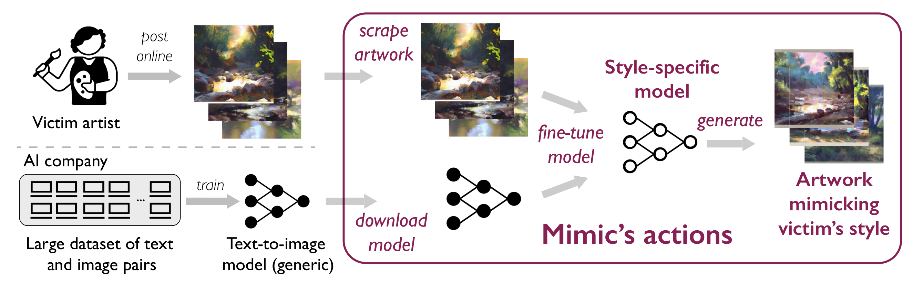

+++
title = 'Glaze'
date = 2023-09-23T02:13:14+09:00
pubdate = 2023-08-01
tags = ["Adversarial Examples", "Text-to-Image", "Style Transfer", "Art", "Image Protection", ]
+++


@inproceedings {291164,
author = {Shawn Shan and Jenna Cryan and Emily Wenger and Haitao Zheng and Rana Hanocka and Ben Y. Zhao},
title = {Glaze: Protecting Artists from Style Mimicry by Text-to-Image Models},
booktitle = {32nd USENIX Security Symposium (USENIX Security 23)},
year = {2023},
isbn = {978-1-939133-37-3},
address = {Anaheim, CA},
pages = {2187--2204},
url = {https://www.usenix.org/conference/usenixsecurity23/presentation/shan},
publisher = {USENIX Association},
month = {Aug}
}




アーティストのスタイルを模倣するテキストから画像への変換モデルの攻撃を防ぐツールGlazeを提案した。コンテンツを維持しつつ、スタイルは別物になるような摂動を加える。
- （Victimではない）ターゲットのスタイルに近づく特徴量シフトを生じさせ、スタイル学習に失敗するような摂動（"Style Cloak"）を加えることで、攻撃を防ぐ。
- アーティストコミュニティと連携して、1156人の参加者を使って定性的な評価を行った。
- 93%の誤生成率、92%は元の画像スタイルを維持。

この論文では、手法の他にもアーティストが生成画像に対してどう思っているのかを記事を参照しながら紹介し、実際にトレースされた事例も挙げている。

-----

## Threat Model

アーティスト
- モデルに模倣されることを防ぎつつ作品を共有したい
- 知覚不能な摂動を共有前に自分の作品に加えて自己防衛したい
- ノーパソみたいな貧弱な計算資源しかないかも

模倣者（攻撃者）
- Victim Styleの高品質な画像を生成したい
- 重みにアクセス可能
- ターゲットのアーティストの画像を数枚入手可能
- 十分な計算資源を持っている

Glazeは学習されても模倣されないような画像を生成することを目指す。

## 先行研究

- 顔画像保護
  - "image cloaking": ユーザ画像の特徴表現から劇的に変わるような摂動を加える
  - ただし、text-to-imageのような大規模な特徴空間では機能しない
    - 画像生成するには多くの属性情報が特徴量に含まれるため、その空間上で同様の摂動を作るのは難しい（生成モデルに対する摂動が難しいという研究がある）
- PhotoGuard
  - 生成モデルに対するAEsを行い許可のない画像編集を防ぐ方法
  - 画像の情報をすべて最小化してしまうため、模倣は防げない（模倣は編集ではなく、FTによる学習が行われるため？）

## Glaze





1. Style Transferを使って、Victimのオリジナル画像を様々なスタイルに変換 
    
    シフト先のスタイル（ターゲット）の画像は、各アーティストとVictimの特徴中心を特徴抽出気（$\Phi$）を使って計算。距離が50-75パーセンタイルにあるものをターゲットスタイルとして候補に選択する。
2. このスタイル変換した画像を使って摂動をガイドする 
    $$ \begin{gathered}
\min _{\delta_x} \operatorname{Dist}\left(\Phi\left(x+\delta_x\right), \Phi(\Omega(x, T))\right) \\
\text { subject to }\left|\delta_x\right|
}}



## 補足

## 現実世界でのトレース事例

- Hollie Mengertの作品がReddit上のモデルでトレースされた。
  - BAIO, A. Invasive Diffusion: How one unwilling illustrator found herself turned into an AI model, 2022 
    
- 漫画家Sarah Andersenが自身の作品がトレースできると報告
  - [The Alt-Right Manipulated My Comic. Then A.I. Claimed It. The New York Times, 2022](https://www.nytimes.com/2022/12/31/opinion/sarah-andersen-how-algorithim-took-my-work.html?smid=tw-nytopinion&smtyp=cur)
  - その関連
    - [MURPHY, B. P. Is Lensa AI Stealing From Human Art? An Expert Explains The Controversy. ScienceAlert, 2022.](https://www.sciencealert.com/is-lensa-ai-stealing-from-human-art-an-expert-explains-the-controversy)
    - YANG, S. Why Artists are Fed Up with AI Art. Fayden Art, Dec. 2022.
- いくつかの会社はそれをサービスとして展開
  - [SCENARIO.GG. AI-generated game assets, 2022](https://www.scenario.com/)
  - 数枚の画像をアップロードすると、それに似たスタイルの画像を生成してくれる。
- [CivitAI](https://civitai.com/)はトレースした作品/モデルをシェアするプラットフォーム

## 感想

- スタイルだけでOKなのか
- AEsの傾向はそのまま維持されてそう