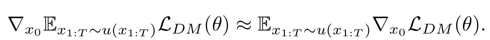
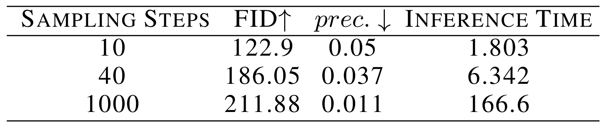
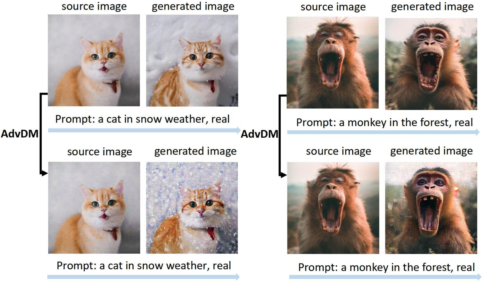

+++
title = 'AdvDM'
date = 2023-10-01T21:11:45
pubdate = 2023-02-02
tags = ["ICML", "Adversarial Examples", "Diffusion Model", "Art"]
cover.image = "image.png"
cover.caption = "コンセプト図"
+++


@misc{liang2023adversarial,
      title={Adversarial Example Does Good: Preventing Painting Imitation from Diffusion Models via Adversarial Examples}, 
      author={Chumeng Liang and Xiaoyu Wu and Yang Hua and Jiaru Zhang and Yiming Xue and Tao Song and Zhengui Xue and Ruhui Ma and Haibing Guan},
      year={2023},
      eprint={2302.04578},
      archivePrefix={arXiv},
      primaryClass={cs.CV}
}




モンテカルロ法を用いて生成過程の潜在変数をおかしくするAEsを生成する手法を提案。PhotoGuardは実写画像がターゲットだったが、AdvDMはアートがターゲット。

-----------

## 課題

- AEsで拡散モデルを攻撃しようにも、分類モデルと比べて難しい
  - 最適化のフローが変分境界を通して間接的に行われる=AEsが直接適用不可能
  - 拡散モデルに対するAEsの既存の方法がない

## AdvDM

特徴抽出をOODにするノイズが生成されるように学習。その損失関数にモンテカルロ法を使う。

### 前提

実分布を $ q(x) $ 生成分布を $ p(x) $ すると摂動 $ \delta $ は次式で求められる。

しかし、 $ q(x) $ は未知なので、モンテカルロ法を使って近似する。$ p_\theta (x) $を使って、$ p_\theta (x+\delta) $を近似する。

各時点の実分布の事後分布 $ q\left(x_{1: T}^{\prime} \mid x_0^{\prime}\right) $は画像 $ x_0 $と独立な固定パラメータのガウス分布なので、生成分布 $ p_\theta (x\prime_(0:T)) $ は$ q\left(x_{1: T}^{\prime} \mid x_0^{\prime}\right) $で正則化できる。

### 最適化

$E_{x_{1: T} \sim u\left(x_{1: T}\right)} \mathcal{L}_{D M}(\theta)$は期待値の損失なので、普通のAEsと違い勾配がわからない。そこで、モンテカルロ法を使って勾配を推定する。

敵対的な生成分布 $ u (x\prime_(1:T)) $ から $ x\prime_(1:T) $ をサンプリングして、$ L_{D M}(\theta) $ の勾配を推定する。

この推定された勾配を使ってFGSMを行う。

異なる潜在変数になる各サンプルをイテレーション。

### 評価

入力画像を使わずに、完全なガウスノイズから生成した画像は評価対象外 
＝コピーライトの心配なし


#### 特徴抽出された特徴がOODになっていることを評価

画像から実際に抽出される条件 $c_g$のほうが無条件でサンプリングされる $c$よりも画像との類似性が高いはず

CFGっぽい

#### アートトレースが危惧されるシナリオ

1. Text InversionベースのT2I
2. Text Inversionベースのスタイル変換
3. I2Iの変換

## 結果

スタイルを強く転送しようとすると、崩壊している感じがする。





## 次に読む論文

- [Mist: Towards Improved Adversarial Examples for Diffusion Models](https://arxiv.org/abs/2305.12683)
