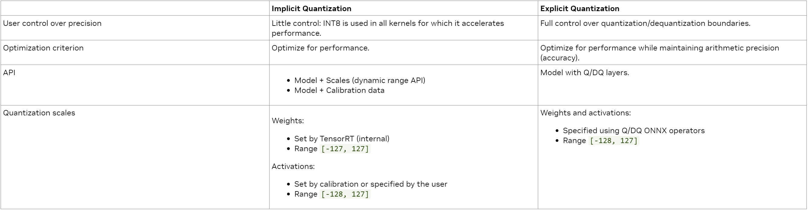

+++
title = 'TensorRT Developer Guideを読んだメモ'
date = 2023-11-13T12:53:11
pubdate = 2023-03-01T00:00:00
# tags = 
draft = true
+++




-----------

## 2. TensorRT's Capabilities

TensorRTには、モデルの定義とターゲットGPUへの最適化を行うビルドフェーズと、最適化されたモデルを実行する実行フェーズの2つのフェーズがあります。

### 2.1 Build Phase

`Builder` を使って、モデルの最適化や `Engine`の作成を行う。手順は次の通り。

1. ネットワークを定義する
   * `NetworkDefinition`インタフェースを定義する。2通りの方法がある。
     * ONNXからTensorRTのONNX parserを呼び出す方法
     * TensorRTの`Layer`や`Tensor`を直接呼び出してネットワークを定義する方法の2つがある。
   * 注意：出力としてマークされていないTensorは一時テンソルとして破棄されるので、出力したかったら名前を指定してやる必要がある。
2. ネットワークのconfigを指定する
   * `BuilderConfig`インタフェースでTensorRTがどうやってモデルを最適化するかを指定する。
     * 精度 (Precision)。
     * 実行時スピードとメモリ効率とのトレードオフの制御
     * CUDAカーネルの選択の制約
3. Builderを呼び出してEngineを作る
    * 1., 2.の情報を使って、`Engine`インタフェースを作る。
    * TensorRTのバージョンとターゲットGPUの種類によってエンジンが作成される。
    * TensorRTのネットワーク定義は浅いコピーなので、ビルドフェーズでメモリの開放はやらないで
    * ビルダは一つだけ動かす。
      * ビルダは最速時間を計測するが、他のGPUでビルダが動いていると実行タイミングがずれるので最適化が弱くなる

### 2.2 Runtime Phase

実行のさせかた。最高位APIは `Runtime` クラス。`Runtime`を使った実行のさせかたは次の通り。

1. TensorRTエンジンをデシリアライズ
2. エンジンから実行コンテクストを作成

そのとき、入出力バッファを用意する必要がある。
推論自体は `enqueueV3`をコールすれば実行できる。

`Engine`インタフェース最適化済みモデルを持っており、はネットワークの入出力情報を提供できる。
一方で、その`Engine`から作成された`ExecutionContext`は推論を呼び出すインタフェース。一つのエンジンに関連付けられた複数の実行コンテクストを作成して、並列実行できる。

入出力のバッファをCPUかGPU上に用意するが、エンジンに問い合わせてどちらにバッファを用意するかを決定できる。
バッファを用意したら`enqueueV3`で実行できる。これにより、必要なカーネルがCUDAストリームにエンキューされ、すぐにアプリケーションの制御が戻される。
CPUとGPUの転送で時間がかかるが、こういった非同期処理を待機したい場合は `cudaStreamSynchronize`を使ってストリームを同期する。

### 2.3 Plugins

TensorRTだけでは対応していないオペレーションの実装を提供する機構。TensorRTの`PluginRegistry`に登録することで、モデル変換時にONNXパーサがプラグインを利用できるようになる。
[詳細](https://docs.nvidia.com/deeplearning/tensorrt/developer-guide/index.html#extending)

### 2.4 Types and Precision

TensorRTはFP32, FP16, INT8, INT32, UINT8, BOOLのデータ型に対応している。

* FP32, FP16
  * 非量子化
* INT8
  * 暗黙的量子化
    * スケールファクタ(dynamic_ranges)が必要。（キャリブレーションか`setDynamicRange` APIで指定）
  * 明示的量子化
    * 符号付き整数に解釈する。Q/DQレイヤを明示的につかってINT8型に相互変換する。
* UINT8
  * 入出力タイプにだけ利用できるデータ型
  * 入力はUINT8からFP32 or FP16に変換される（`CastLayer`）
  * 出力も`CastLayer`でUINT8を出力する。
  * 量子化は非対応
  * `ConstantLayer`は出力タイプとしてはUINT8に非対応
* BOOL

Precisionを指定する方法は次の2つある。

* モデルレベル：`BuilderFlag`オプションで低精度を指定する
* レイヤレベル：レイヤごとに精度を指定して、数値的にセンシティブな箇所に対処する

### 2.5 Quantization

Dynamic rangeはビルダ（キャリブレーション）かQATで計算できる。

TODO: [ここはもう少し詳しく書く](https://docs.nvidia.com/deeplearning/tensorrt/developer-guide/index.html#working-with-int8)

TensorRTの量子化はSymmetric Uniform Quantization（Siggned INT8）。  
量子化前後の変換は単純な乗算で表現できる。 

量子化対象：アクティベーション、重み  
アクティベーション向けの量子化は、キャリブレーションアルゴリズムに依存する。
重み向けの量子化は、 

$$
s=\frac{\max \left(\operatorname{abs}\left(x_{\min }\right), \operatorname{abs}\left(x_{\max }\right)\right)}{127}
$$

で計算される。

**量子化**  

このスケールsが与えられたとき、量子化/逆量子化演算は $ x_q=\[-128, 127\] $ の整数値、$ x $をアクティベーションの浮動小数点とすると、

$$
x_q=\text { quantize }(x, s):=\operatorname{roundWithTiesToEven}\left(\operatorname{clip}\left(\frac{x}{s},-128,127\right)\right)
$$

`roundWithTiesToEven`は、最も近い偶数になる。23.5や24.5は24、-23.5や-24.5は-24になる。

ただし、OrinのDLA向けだとちょっと丸め関数が違うらしい

$$
x_q=\text { quantize }(x, s)=\text { roundWithTiesToNearestEven }\left(\operatorname{clip}\left(\frac{x}{s},-128,127\right)\right)
$$


**逆量子化**

$$
x=\operatorname{dequantize}\left(x_q, s\right)=x_q * s
$$


量子化演算を有効にするには Builder config でINT8フラグを有効にする必要がある。

#### 暗黙的量子化

各量子化テンソルに紐づいたスケールを使って暗黙的な量子化や逆量子化を行う。  

暗黙的量子化の場合、TensorRTはまずグラフを最適化するときには浮動小数点モデルとして扱い、レイヤがINT8で高速になる場合にINT8で実行する。それ以外はFP32かFP16。  
APIレベルでレイヤごとに明示的に精度を設定しても、TensorRTのグラフ最適化中に別のレイヤと融合することがあるのでレイヤごとの精度の情報が失われることがある。  
INT8が使われるかどうかが制御しづらい。

#### 明示的量子化

スケーリング演算を使って量子化、逆量子化が明示的に `iQuantizeLayer`と`IDeqantizeLayer`ノード（Q/DQノード）によって行われる。   
明示的量子化ではINT8で量子化することを明示的に指定できる。  

PyTorchやTensorFlowからエクスポートされるONNXにはQ/DQノード（Qノードの後にDQノードが続く、Fake-Quantization）が明示的に使われることがある。  
TensorRTではそれらのQ/DQレイヤのセマンティクスを保持するので、性能劣化が少ない。（意訳）  
しかし、内部の浮動小数点演算の順序が変わる可能性があるので、ビット単位で結果が一致することはない。



#### 量子化スケール

次の2種類の粒度でスケーリングできる。

- テンソルごとのスケール：単一のスケール値でテンソル全体をスケーリング
- チャネルごとのスケール：指定された軸にそってスケール値をブロードキャストしてスケーリング

重みはどちらかの方法でスケール、アクティベーションはテンソルごとのスケーリングのみ。

例）重みのチャネルごとのスケーリング。2D Convカーネルの重みのshapeが `KCRS`で`K`が出力チャネル数だとすると、  
出力チャネルに対してスケーリングすることに注意する。ただし、Deconvolutionは入力チャネルに対してスケーリングする。

```python
for k in range(K):
  for c in range(C):
    for r in range(R):
      for s in range(S):
        weight[k, c, r, s] = clamp(round(weight[k, c, r, s] / scale[k]), -128, 127)
```

↑の例で逆量子化の場合は

```python
for k in range(K):
  for c in range(C):
    for r in range(R):
      for s in range(S):
        output[k, c, r, s] = input[k, c, r, s] * scale[k]
```

#### Dynamic Range

Dynamic rangeは量子化されたテンソルによってカバーされる範囲で、外部で求められた暗黙的な量子化に使われる。 
dynamic rangeは(min, max)が設定できるが、TensorRTはSymmetric Uniform Quantizationしかサポートしていないので、 `max(abs(min_float), abs(max_float))` でスケールされる（大きい方）。


### 2.7 Dynamic shape

TensorRTは入力形状に基づいてモデルを最適化するが、実行時に動的な形状をサポートしている。`OptimizationProfile`最小、最大入力形状を指定する。

TODO: [ここはもう少し詳しく書く](https://docs.nvidia.com/deeplearning/tensorrt/developer-guide/index.html#work_dynamic_shapes)

### 2.8 DLA

TODO: [ここはもう少し詳しく書く](https://docs.nvidia.com/deeplearning/tensorrt/developer-guide/index.html#dla_topic)

### 2.10 `trtexec`

* ランダム値 or ユーザ指定のデータを使ったネットワークベンチマーク
* モデルのエンジン化（シリアライズ化）
* ビルダからシリアライズ化されたタイミングキャッシュを作成

### 2.11 Polygraphy

TensorRTモデルの実行やデバッグをするためのツール。

* 複数のバックエンドで実行する (TensorRT, ONNX-runtime)
* モデルを複数フォーマットに変換する。
  * e.x. TensorRT engine with post-training quantization
* モデルの様々なタイプの情報表示
* ONNXモデルをコマンドラインから変更
  * サブグラフの抽出
  * 単純化やサニタイズ化 (simplify and sanitize)


### I/O Formats

TODO: [ここはもう少し詳しく書く](https://docs.nvidia.com/deeplearning/tensorrt/developer-guide/index.html#reformat-free-network-tensors)

